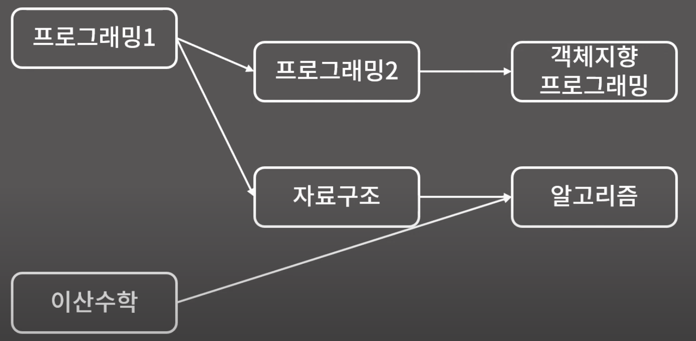

# 위상정렬 (O(V+E))

**⭐️ 사이클이 존재하지 않는 방향 그래프에서 적용 가능한 알고리즘**

> 방향 그래프에서 **정점 간 선후관계**를 위배하지 않도록 나열하는 정렬  
> ex. 선수강 과목

- `원소 간 선후관계`가 주어지고, `이들의 순서를 정해야 하는 상황`에서 위상정렬 알고리즘을 활용할 수 있음


출처: [바킹독 실전 알고리즘 - 위상정렬](https://youtu.be/Th-gLZUrd04?si=GSxAX-vkpkLWjPXP)

```
< 위상정렬 알고리즘의 핵심 >

indegree가 더이상 존재하지 않는 노드를 방문한 순간부터는, 해당 노드를 무시해도 된다.
```

1. `indegree`(= previous)가 존재하지 않는 노드를 방문한다.
2. 방문한 노드는 삭제한다. (= 해당 노드와 연결된 모든 간선을 지운다)
   - **_해당 노드를 방문하는 순간부터는 선수강 조건에 아무런 제약이 존재하지 않기 때문_**
3. 방문한 노드와 연결된 다음 노드의 `indegree`를 1 감소시킨다.
4. 이때, `indegree`가 0이 되면 다음 탐색 후보에 넣는다.
