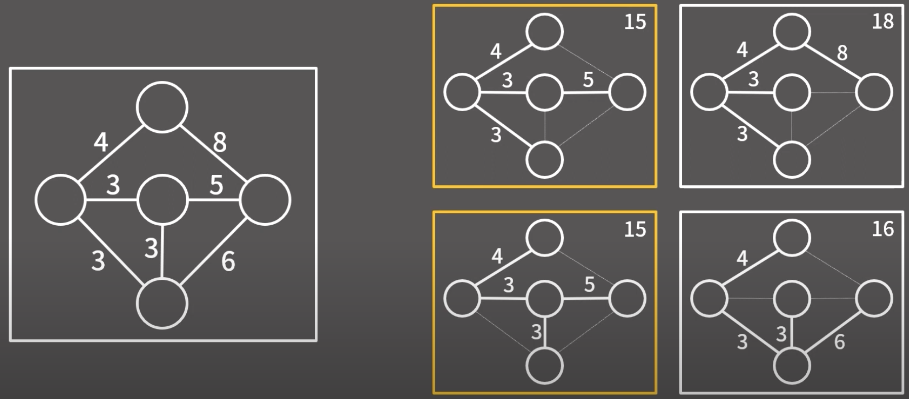

# 최소 신장 트리 (MST)

> **_신장 트리_** - **방향이 없는 그래프의 부분 그래프**들 중, 모든 정점을 포함하는 트리  
> **_최소 신장 트리_** - 신장 트리 중에서도 비용의 합이 가장 작은 것


출처: [바킹독 실전 알고리즘 - 최소 신장 트리](https://youtu.be/4wA3bncb64E?si=cP1RdoTQOnJ96ICk)

### 크루스칼 알고리즘

- 그리디 알고리즘
- Union Find

> 1. `가장 비용이 낮은 간선`부터 신장 트리에 추가한다.
> 2. 이때, 간선을 구성하는 **두 노드가 이미 같은 그룹에 존재하는 경우**에는 해당 간선을 그룹에 추가하지 않는다. _(사이클이 발생하기 때문)_
> 3. 위 과정을 **추가된 `간선 수가 v-1개`가 될 때까지** 반복한다. _(연결 그래프는 v개의 정점과 v-1개의 간선으로 이뤄짐)_

1번 과정에서는 **_그리디 알고리즘_**, 2번 과정에서는 **_Union Find 알고리즘_** 을 활용함을 알 수 있음

#### Union Find

두 값이 서로 동일한 집합에 속해있는지 확인하는 알고리즘. 트리에서는 **두 노드의 최상위 부모** _(= 그룹 내 최소값을 갖는 노드)_ 를 비교하여, 서로 같은 그룹에 속해있는지 확인할 수 있다.

#### 최소 신장 트리 찾기 예제 (with 크루스칼)

```cpp
#include <iostream>
#include <tuple>
#include <vector>

using namespace std;

tuple<int, int, int> edge[10]; // cost, start, end 순
int parent[10];

int get_parent(int n) {
    if (parent[n] == n) return n;
    return parent[n] = get_parent(parent[n]);
}

bool is_same_group(int a, int b) {
    int a_p = get_parent(a);
    int b_p = get_parent(b);

    if (a_p == b_p) return true;
    // 더 작은 값으로 최상위 노드를 재설정
    if (a_p < b_p) parent[b_p] = a_p;
    else parent[a_p] = b_p;
    return false;
}

int main() {
    int n; // 간선 수
    cin >> n;
    int v; // 노드 수
    cin >> v;

    // parent 배열 init
    for (int i = 1; i <= v; ++i) {
        parent[v] = v;
    }

    // 간선 입력
    for (int i = 0; i < n; ++i) {
        int s, e, c;
        edge[i] = make_tuple(c, s, e);
    }

    sort(edge, edge+n); // 비용 기준 오름차순

    int edge_cnt = 0;
    int sum = 0;
    for (int i = 0; i < n; ++i) {
        tuple<int, int, int> coord = edge[i];
        int a = get<1>(coord);
        int b = get<2>(coord);
        if (!is_same_group(a, b)) {
            edge_cnt++;
            sum += get<0>(coord);
        }
        // 간선의 수가 v-1개가 되면 종료 (연결 그래프 조건)
        if (edge_cnt == v-1) break;
    }

    cout << sum << '\n'; // 최소 신장 트리 비용 출력

    return 0;
}
```
