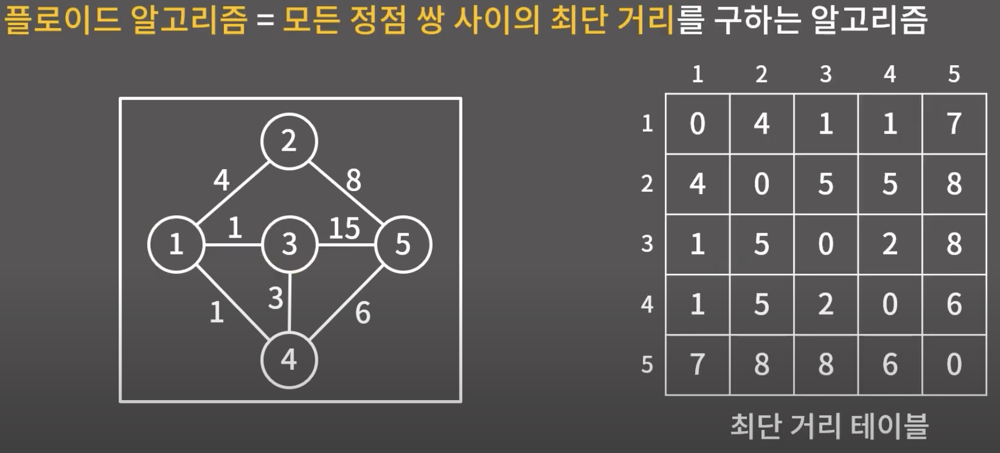

# 플로이드 (O(N^3))

> **모든 정점 간의 최단거리**를 구하는 알고리즘  
> ⭐️ `각 정점의 경유 여부`를 기준으로 최단거리를 계산한다.

### 설계

**_인접 리스트_** 를 주로 다뤘던 다른 그래프 알고리즘들과 다르게, 플로이드는 `인접 행렬`을 사용한다.

```
graph[i][j] - i 노드부터 j 노드까지 이동하는 최소 비용
```


출처: [바킹독 실전 알고리즘 - 플로이드](https://youtu.be/dDDy2bEZRA8?si=Db7KcNjaypoemWrY)

```
- 각 정점을 기준으로, 해당 정점을 경유할 것인지 경유하지 않을 것인지 결정한다.
- 만약 해당 정점을 경유할 때의 비용이 현재 비용보다 적은 경우, 비용을 갱신한다.
```

> 즉, 각 정점(mid)에 대해서 `graph[start][mid] + graph[mid][end] < graph[start][end]`를 만족할 경우, `graph[start][end]` 값을 해당 값으로 갱신 **_(= mid 노드를 경유)_** 한다.

모든 start _(V개)_ ~ end _(V개)_ 사이에 V개의 경유지를 거치는지 확인하므로, `V^3`의 시간복잡도를 갖는다.

### 플로이드 + 최단 경로 추적

하지만 일반적인 플로이드 알고리즘으로는 `최단 거리 비용`은 알 수 있지만, **그 `경로`는 알 수 없다.**

- 모든 정점간의 **최단 거리와 그 경로**를 구하기 위해서 `next 배열`을 활용할 수 있다.


```
next[i][j] - i 노드부터 j 노드까지 최단경로로 이동하기 위해, 바로 다음에 방문해야 할 노드 번호
```

> 마찬가지로 각 정점(mid)에 대해서 `graph[start][mid] + graph[mid][end] < graph[start][end]`를 만족할 경우, `next[start][end]` 값을 갱신한다.
>
> ⭐️ 특히 이때, mid 값이 아닌 `next[start][mid]` **_(= start에서 mid까지 최단 경로로 이동하기 위해, 바로 다음에 방문할 노드)_** 값으로 갱신해야 한다.

#### 예제 코드

```cpp
#include <iostream>

const int INF = 9999;

using namespace std;

int main() {
    int n, e;
    cin >> n >> e;
    int graph[n+1][n+1];
    int nxt[n+1][n+1];
    for (int i = 1; i <= n; ++i) {
        for (int j = 1; j <= n; ++j) {
            nxt[i][j] = 0;
            if (i == j) graph[i][j] = 0; // 자기 자신으로 가는 경로는 0
            else graph[i][j] = INF; // 초기 거리는 INF 값으로 초기화
        }
    }

    for (int i = 0; i < e; ++i) {
        int start, end, cost;
        cin >> start >> end >> cost;
        graph[start][end] = cost;
        // graph[end][start] = cost; // 양방향 그래프
        nxt[start][end] = end;
        // nxt[end][start] = start; // 양방향 그래프
    }

    // 플로이드 + 경로
    for (int mid = 1; mid <= n; ++mid) {
        for (int start = 1; start <= n; ++start) {
            for (int end = 1; end <= n; ++end) {
                if (graph[start][mid] + graph[mid][end] < graph[start][end]) {
                    graph[start][end] = graph[start][mid] + graph[mid][end]; // 플로이드 (최단거리 비용)
                    nxt[start][end] = nxt[start][mid]; // 경로
                }
            }
        }
    }

    // start ~ end 까지의 최소 비용과 그 경로를 출력
    for (int start = 1; start <= n; ++start) {
        for (int end = 1; end <= n; ++end) {
            cout << "start: " << start << ", end: " << end << '\n';
            cout << "최소 비용: " << graph[start][end] << '\n';

            int cur = start;
            while (cur != end) {
                cout << cur << ' ';
                cur = nxt[cur][end];
            }
            cout << end << '\n';
        }
    }
    return 0;
}
```
